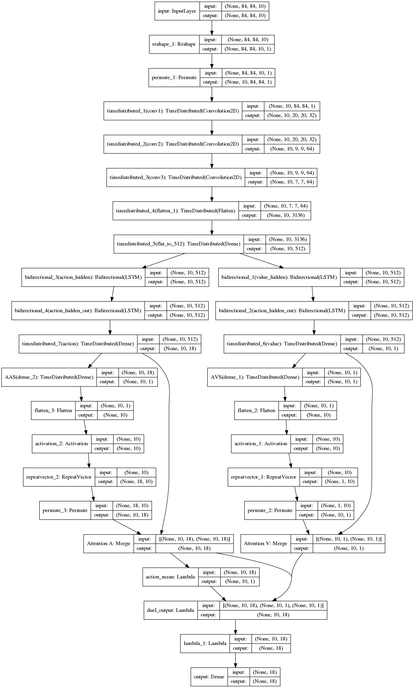

## Visual-Explanation-in-Deep-Reinforcement-Learning-through-Guided-Backpropagation-and-GradCam
Deep Reinforcement Learning (DRL) connects the classic Reinforcement Learning algorithms with Convolutional Neural Networks (CNN). A problem in DRL is that the CNN is a black-box and it's not easy to understand the decision-making process of the agent. In order to be able to use the programs in highly dangerous environments for humans and machines, the developer needs a debugging tool to improve that the program does what is expected.\\\newline
This work brings some of the best-known visualization methods from the field of image classification to the area of Deep Reinforcement Learning (DRL).Furthermore, 2 new visualization techniques have been further developed, one of which provides particularly good results.\\ 
It is checked to what extent the algorithms can be used in the area of Reinforcement learning. Furthermore, the question also arises how well the different DRL algorithms can be visualized in different environments from different visualization techniques.\\\newline
Among other things the results of this work refutes the claims made in the papers "Visualizing and Understanding Atari Agents"\cite{visualAtari} that guided backpropagation cannot be used for visualization techniques. Furthermore, the assertion made in the paper "Sanity Checks for Saliency Maps" \cite{sanityChecks} that Guided Backpropagation and Guided GradCam (at least in image processing) do not visualize the learned model but work similarly to an edge detector, do not apply to deep reinforcement learning as it does is shown in this work.\\\newline
However, since the results of the visualization techniques strongly depends on the quality of the neural network, two new architectures for off-policy algorithms were also developed in this work. Both developed Networks, beat the previous state-of-the-art off-policy Network.

# Deep Reinfocement Learning Algorithms:

[off Policy algorithms:]
- [X] DQN
- [x] DDQN
- [x] Dueling DDQN
- [X] LSTM DQN
- [X] Bidirectional LSTM DQN
- [X] Attention LSTM DQN
- [X] Splitted Attention LSTM DQN

[on Policy algorithms:]
- [X] A3C
- [X] A3C Bidirectional LSTM with Attention Network

# Visualization Techniques:

- [X] Backpropagation
- [x] Guided Backpropagation
- [X] GradCam
- [X] Guided GradCam
- [ ] SmoothGrad
- [ ] Perturbation-based Saliency Map

## Splitted Attention DDQN
I Introduce a new model of an off-policy network which performes better then the state of the art Attention DDDQN (In average this Splitted Attention DDQN Network is making 7-8000 points in the game Seaquest-v0. DDDQN with Attation what I take as Basline the Network made 3-4000 Points). 
This Network has in the input time distributed convolutional layers after that we splitt the layers into an advatage and a value stream. On the bottom of both we have bidriectional LSTM networks followed with an attention network. On the end we bring both streams together like in the dueling Network.




For now we will compare how good we can visualize DQN and dueling double DQN Algorithms. As environment we will use ATARI.


If you have a trained dueling agent and you want visualize what he learned run:

```console
python3 main.py --test_dqn --gbp --dueling True --ddqn True --test_dqn_model_path saved_dqn_networks/XXXX.h5
```
otherwise train your agent with 

```console
python3 main.py --train_dqn --dueling True --ddqn True
```
and you can test how the agent plays with:

```console
python3 main.py --test_dqn --do_render --dueling True --ddqn True --test_dqn_model_path saved_dqn_networks/XXXX.h5
```


## some results

# A3C
In this GIF you can see the different visualizations for the A3C algorithm Playing Breakout-v0 with 3 frames:


# DDDQN
Here we can see how the agent is looking more on his position (in the advantage part of the neuronal network [right figure] and how he is looking more on the reward in the value function part of the network [left figure].
(left value || right advantage)


For Attention Networks:

train:
```console
python3 dqn_atari.py --net_mode duel --ddqn --num_frames 10 --no_monitor --selector --bidir --recurrent --a_t --selector --task_name 'SpatialAt_DQN' --seed 36 --env 'SeaquestDeterministic-v0'
```
test:
```console
python3 dqn_atari.py --net_mode duel --ddqn --num_frames 10 --recurrent --a_t --bidir --selector --task_name 'SpatialAt_DQN' --test --load_network --test --load_network_path=log/SeaquestDeterministic-v0-run6-SpatialAt_DQN/qnet7628.h5 --env 'SeaquestDeterministic-v0'
```
