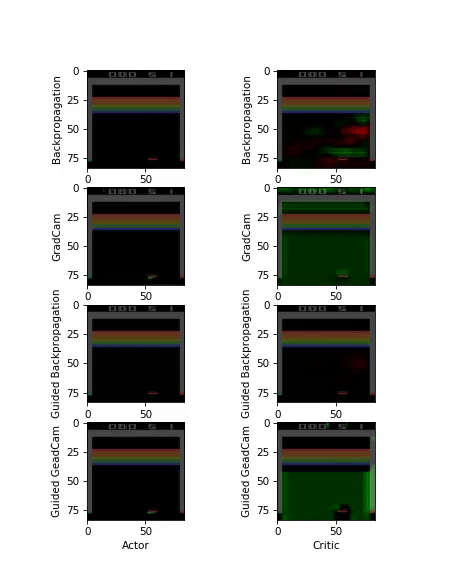

## Visual-Explanation-in-Deep-Reinforcement-Learning-through-Guided-Backpropagation-and-GradCam
This is the first algorithm which visualizes the knowledge of an agent trained by Deep Reinforcement Learning (paper will be published in March) using backpropagation / Guided Backpropagation / GradCam and Guided GradCam. The goal of the work is to  shows why the agent is performing the action. Which pixels had the biggest influence on the decision of the agent.


## Splitted Attention DDQN
I Introduce a new model of an off-policy Network which performe better then the state of the art Attention DQQN


# Deep Reinfocement Learning Algorithms:

[off Policy algorithms:]
- [X] DQN
- [x] DDQN
- [x] Dueling DDQN
- [X] LSTM DQN
- [X] Bidirectional LSTM DQN
- [X] Attention LSTM DQN
- [X] Splitted Attention LSTM DQN

[on Policy algorithms:]
- [X] A3C
- [X] A3C Bidirectional LSTM with Attention Network

# Visualization Techniques:

- [X] Backpropagation
- [x] Guided Backpropagation
- [X] GradCam
- [X] Guided GradCam
- [ ] SmoothGrad
- [ ] Perturbation-based Saliency Map


For now we will compare how good we can visualize DQN and dueling double DQN Algorithms. As environment we will use ATARI.


If you have a trained dueling agent and you want visualize what he learned run:

```console
python3 main.py --test_dqn --gbp --dueling True --ddqn True --test_dqn_model_path saved_dqn_networks/XXXX.h5
```
otherwise train you agent with 

```console
python3 main.py --train_dqn --dueling True --ddqn True
```
and you can test how the agent plays with:

```console
python3 main.py --test_dqn --do_render --dueling True --ddqn True --test_dqn_model_path saved_dqn_networks/XXXX.h5
```


# some results
In this GIF you can see the different visualizations for the A3C algorithm Playing Breakout-v0 with 3 frames:



Here we can see how the agent is looking more on his position (in the advantage part of the neuronal network [right figure] and how he is looking more on the reward in the value function part of the network [left figure].
(left value || right advantage)


For Attention Networks:

train:
```console
python3 dqn_atari.py --net_mode duel --ddqn --num_frames 10 --no_monitor --selector --bidir --recurrent --a_t --selector --task_name 'SpatialAt_DQN' --seed 36 --env 'SeaquestDeterministic-v0'
```
test:
```console
python3 dqn_atari.py --net_mode duel --ddqn --num_frames 10 --recurrent --a_t --bidir --selector --task_name 'SpatialAt_DQN' --test --load_network --test --load_network_path=log/SeaquestDeterministic-v0-run6-SpatialAt_DQN/qnet7628.h5 --env 'SeaquestDeterministic-v0'
```
